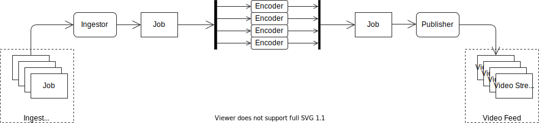
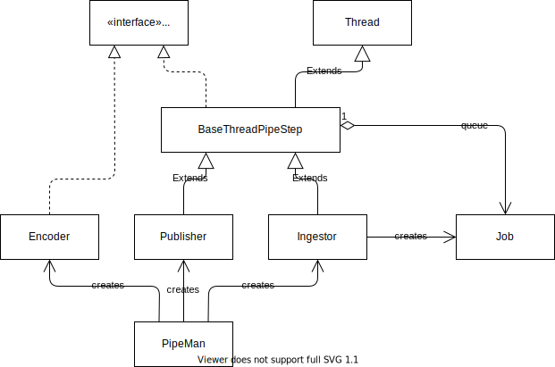

# Image Video Player

### Table of Contents
  1. [Objective](#1-objective)
  2. [Overall assumptions](#2-overall-assumptions)
  3. [Key design decisions](#3-key-design-decisions)
  4. [High Level Architecture](#4-high-level-architecture)
  5. [How this solution meets the overall assumptions](#5-how-this-solution-meets-the-overall-assumptions)
  6. [Detailed design](#6-detailed-design)
    - [A. The Ingest storage](#a-the-ingest-storage)
    - [B. The *vidfeed* storage](#b-the-vidfeed-storage)
    - [C. The Web Server](#c-the-web-server)
    - [D. The Web Client Application](#d-the-web-client-application)
    - [E. The Encoder](#e-the-encoder)
    - [F. The Pipeline Manager](#f-the-pipeline-manager)


### 1. Objective

Given a set of image sequences, each one representing a frame from a video
stream, provide a solution to playback such video stream in a web browser.  

- - -

### 2. Overall assumptions
The solution was designed assuming the following requirements:

  - **Whenever applicable, use of widely adopted industry standards:** the video
  and media industry is extensively standardized worldwide. By using well
  established standards, the system can be easily interoperable/integrable with
  other systems and built from *out of the shelf* components (such as encoders,
  players, etc.).

  - **Whenever applicable, use open source components:** this accelerates time
  to market and reduces development effort/cost (programming, testing, etc.).
  Special attention must to be paid to the license terms of the open software,
  avoiding the usage of components using copyleft licenses (such as GPL), that
  may impose restrictions on how the solution is distributed and/or
  commercialized. On the other hand, components using permissive licenses, such
  as MIT, BSD or Apache License v2, are preferred.

  - **Prioritize user experience:** once the image sequence is available the
  playback experience must be as smooth as possible. Playback should be possible
  in desktop computer as well as in mobile devices.

  - **Minimize network bandwidth:** by reducing the amount of network has a
  direct benefit on operational cost. Also reduces the bandwidth and connection
  quality requirements on the user side.

  - **Minimize long term storage requirements:** image and video contents are 
  highly demanding in terms of storage. In the long term, keeping an archive of
  contents generated along a certain period of time, may become highly costly as
  well.

  - **Support to long duration, different frame rates and high resolution image
  sequences:** image sequence can be longer than 1h and being captured at
  different video formats (HD, FullHD, QHD, 4K, etc.) and different frame rates.
  The solution must be capable of handling all these cases seamlessly.

  - **Compatibility with number of user's devices and web browsers:** the web
  interface and player must be compatible with a major number of modern 
  browsers and user devices (average mobiles phones, tablets and desktop
  computers).

  - **Modular design:** the pieces that compose system must have very well
  defined and simple interfaces so they can be easily interchangeable/replaced
  with other components from different providers (i.e.: if an encoder component
  from a given vendor is used, then such component could be easily
  interchangeable with and equivalent component from another provider).

  - **Scalable and cloud deployable:** the system design must be easily scalable
  according to the grow of the workload and its usage. It must be possible to
  run it in own self hosted environments as well as in cloud computing
  providers.

- - -
  
  
### 3. Key design decisions

The most important aspect of the solution is the usage of **MPEG-DASH (ISO/IEC
23009-1)** as the transport from the backend to the client.

The image sequences are encoded into video chunks on the backend using H.264 and
a DASH manifest is created. The web client uses a dash player and the
built in video decoding capabilities in the user's browser (which are usually
implemented using hardware decoding acceleration).

For encoding the images into MPEG-DASH streams, it is being used the 
[ffmpeg project](https://www.ffmpeg.org/) as proof of concept. Depending on
specific projects needs, this component could be replaced by commercial, much
more efficient, encoder equipment or specialized cloud based services. In terms 
of the video codec, H.264 is being used since it is widely supported in user's
devices (including average mobile phones and tablets). A more efficient
encoding, such HEVC or AV1 could be used as well, if it is acceptable not to
support older user's devices.

For the playback in the web browser, it is being used the
[dash.js](https://github.com/Dash-Industry-Forum/dash.js/wiki) open source
library, developed and maintained by the [DASH Industry Forum](https://dashif.org/).

As a further enhancement, the encoder phase could generate multiple copies of
the same video chunks at different bitrates and resolutions, thus enabling the 
adaptive streaming capabilities supported by the MPEG-DASH. But this may impact
the requirement related to optimize the storage requirement. In this case user
experience vs. content storage should be leveraged.

All system modules are deployed within Docker containers. This makes them self
contained and easily to be deployed in cloud environments. According to the
workload and system usage, new instances can be spawned to increase the system
processing capability.

  > **A side note on using video codecs**
  >
  > Dealing with videos and images is, usually, dealing with
  > _**HUGE ~~BIG~~ DATA**_. When dealing with huge amounts of data, every 
  > single percentage digit of compression rate matters. The modern video codecs
  > aims to be as most efficient as possible in achieving optimal ratios of data
  > compression and quality. 
  >
  > While JPEG do a very efficient work with single static images, when dealing
  > with moving images, video codecs are much more efficient. Efficiency of the
  > video codec becomes even much higher when a relevant part of the scene
  > remains static. A very clear example of this are fixed cameras, such as
  > security cameras, where movements occurs just in some part of the plane.  
  >
  > To illustrate this, the following table demonstrates how the current solution
  > optimizes the sample sequences used for testing:
  >
  > | Sequence    | Size of jpeg image sequence | Size of MPEG-DASH stream | Improvement |
  > | ----------- | :-------------------------: | :----------------------: | :---------: |
  > | seq01 | 1,690.54 KB  | 487.69 KB    | 71.15% |
  > | seq02 | 23,879.04 KB | 11,219.55 KB | 53.02% |
  > | seq03 | 77,845.91 KB | 51,298.08 KB | 34.10% |
  > | seq04 | 44,061.98 KB | 25,695.46 KB | 41.68% |
  > | seq05 | 13,638.90 KB | 8,112.06 KB  | 40.52% |
  > | seq06 | 24,053.48 KB | 7,871.82 KB  | 67.27% |
  >  
  > _**Note:** the improvement indicates how much smaller is the MPEG-DASH
  > stream in comparison to the jpeg image sequence._  

##### Drawbacks of this solution

By encoding the images as video streams, the following disadvantages are implied:
  - Much higher computational processing is required on the backend;
  - Image sequences do not become available to the user immediately, but only
  after the encoding process is completed. 
 
Both of this can be compensated by using specialized encoding hardware or cloud
services (probably at a higher operational cost).

The second drawback can be also addressed by taking advantage of MPEG-DASH 
splitting, by publishing the manifest as soon as a few chunks become ready, and
progressively update it as new ones become available. 

Still, the solution must to be proven to be economically better by ensuring that
the encoding costs are lower or equal to the difference of data traffic and long
term storage between this approach and serving images directly from the server. 

- - -

### 4. High Level Architecture

The system is divided into three main modules, each one containerized in a docker
image. The **Pipeline Manager** module is intended to be run as a single instance. 
On the other hand, the **Web Client** and the **Encoder** modules are designed
to be executed as a single or multiple instances, depending on the system work
load. Also two docker volumes are used, one for ingesting the image sequences
and a second one for publishing and storing the processed MPEG-DASH video
streams.


  1. **Ingest Storage:**
    A storage volume where the *image sequences* to be processed are placed.
    Each sequence is put into a directory. The *image sequences* must be
    accompanied by a *job descriptor file*. The combination of an
    *image sequence* + *job descriptor file* is defined as a **job**.  

  2. **Pipeline Manager (*pipeman*):**
    This is the backend orchestrator. It monitors the *Ingest storage* for new
    *jobs* and assigns them to the first available *Encoder*. Once the *job*
    encoding is complete, it publishes the *job* into the *Video feed storage*.
  
    The Pipeline Manager is based in a Docker OpenJDK image.  

  3. **Encoder:**
    Processes the image sequences in a *job*, encoding them as an MPEG-DASH
    video stream using H.264. The first image frame width and height determines
    the resolution of the output stream. The frame rate of the encoded stream is
    defined in the *job description file*. The image sequences are read directly
    from the *Ingest storage* and the generated MPEG-DASH video streams are
    placed into the *Video feed storage*.

    The Encoder is based in a _Docker Alpine Linux image_, including the _ffmpeg_
    package.  

  4. **Video feed storage:**
    A storage volume where the MPEG-DASH streams are placed.  

  5. **Web Server:**
    Uses an [nginx](https://www.nginx.com/) HTTP server to serve:
      - MPEG-DASH video stream stored in the *Video feed storage*;
      - static contents of the _Web Client_ application.

    The Encoder is based in a Docker NGINX image.  

  6. **Web Client (*webclient*):**
    An HTML5/CSS3/Javascript application that is executed in the user's web
    browser. It lists all the published MPEG-DASH video streams and playbacks
    them in an embedded player. The player has three controls: _play/resume_,
    _pause_ and _re-start_. 

    

    [Boostrap](https://getbootstrap.com/) is used for theming and responsiveness.
    The application control flow is implemented using 
    [AngularJS](https://angularjs.org/). And the playback of the MPEG-DASH video
    stream is implemented with the library
    [dash.js](https://github.com/Dash-Industry-Forum/dash.js/wiki).

    Finally, this documentation, written in markdown, is being rendered using 
    [Showdown](https://github.com/showdownjs/showdown).  


- - -

### 5. How this solution meets the overall assumptions

##### A. Encoding the image sequences as MPEG-DASH / H.264 video stream

Using this approach for storing and serving them to the web client the following
assumed requirements are met:

  - **Prioritize user experience:** smaller amount of data to be transferred
  implies in less bandwidth needs and faster data transfers. MPEG-DASH is
  specially designed for video network streaming and very robust to handle
  transmission on bad quality connections. The preloading capabilities built
  in the *dashjs* library provides a smooth playback, minimizing interruptions
  that may occur due to irregular network bandwidth.

  Playback can be resumed at any time, eased by the fact of the streams are 
  split into chunks.

  Video decoding/playback is backed by native/hardware media capabilities in
  the user device, which helps even more in a achieving a smooth playback.  

  If needed, adaptive streaming capabilities can be easily enabled, by
  adjusting the encoder configuration, but at expenses of higher processing
  and storage requirements on the backend side. 

  - **Minimize network bandwidth:** MPEG-DASH in combination with H.264 encoding
  allows to generate a much smaller amount of outgoing traffic.

  - **Minimize long term storage demand:** since MPEG-DASH streams are significant
  smaller than the JPEG image sequence, implies in lower storage requirements
  and operational cost for long term archiving.

  - **Support to long duration, different frame rates and high resolution image
  sequences:** MPEG-DASH provides support for long duration clips and even live
  streaming. H.264 codec supports a wide range of industry standard video
  formats and frame rates. 

  - **Compatibility with number of user's devices and web browsers:** H.264
  decoding is widely supported by hardware in web browsers of almost all
  modern average devices. _dashjs_ is a javascript library that
  handles the MPEG-DASH envelope using regular Javascript and relies on the
  web browser's built-in video decoding capabilities to decode an playback the
  video.
  
  - **Modular design:** by using an open standard, broadly implemented by
  different providers, it would be easy to replace use encoding and playback
  solutions from different suppliers.

##### B. Using Docker container

By using this approach the following requirements are met:

  - **Modular design:** helps defining the boundaries and interfaces of each
  system's module and the dependencies among each others.

  - **Scalable and cloud deployable:** Docker containers can be deployed into
  swarms hosted in by cloud service providers such as AWS, Google Cloud or
  Microsoft Azure. Encoder and Web Server container new instances can be spawned
  or terminated according to the system workload and usage.

##### C. Using FFMPEG and dash.js

By using these two open source projects it was possible to build this solution
within the required timeframe. The license terms of both projects, LGPL v2.1 and
BSD, respectively, do not limit or impose restrictions on the distribution of
the solution.

##### D. Using Boostrap and AngularJS in the web client

The web client has been developed following the mobile first principle. The
Boostrap framework have been chosen since it is helpful in building responsive
applications. Many frameworks and libraries serves this purpose, but I have 
used it many times in the past, and I am quite familiar with it.

AngularJS has been chosen because I am quite familiar with it as well.

The choice of these two frameworks enabled speeding up the development process
and deliver the solution on time. 

- - -

### 6. Detailed design

In this section are described some relevant details of the implementation.

##### A. The Ingest storage

This is a docker volume mounted in a host directory (project's folder `ingest`)
where the image sequences to be processed and published must be placed.

Each image sequence must be placed in a separated directory, and must have a 
*job description file* associated to it, also in the same directory.

The *Pipeline Manager* monitors the *ingest* volume and, whenever a new sequence
is placed here, it starts processing it. The *Encoder* will read the input
images directly from this volume as well. Once the *Encoder* finishes processing
the image sequence, its directory is deleted.

**The _job description file_**

Each image sequence to be processed must be accompanied of a *job description
file*. It is a json file according to this json-schema:
```json
    {
        "type": "object",
        "properties": {
            "title":    { "type": "string" }, /* Image sequence title         */
            "desc":     { "type": "string" }, /* Image sequence description   */
            "frames_n": { "type": "number" }, /* Total number of frames       */
            "fps":      { "type": "number" }, /* Frame rate (fps)             */
        },
        "required": [ "title", "desc", "frames_n", "fps"] 
    }
```

An example of a valid *json description file*
```json
    {
        "title": "Image sequence #01",
        "desc":  "This is a sample image sequence composed of 150 frames captured at a frame rate of 5fps.",
        "frames_n": 150,
        "fps": 5
    }
```

##### B. The *vidfeed* storage

This is implemented as a Docker managed volume. It contains all the image
sequences processed and encoded, by the *Encoder*, into MPEG-DASH video streams. 

In order to an image sequence be considered published, it must be listed in the
*streams.json* file.

The json-schema of the streams.json file is the following:

```json
    {
        "type": "array",
        "uniqueItems": true,
        "items": {
            "type": "object",
            "properties": {
                "dir":      { "type": "string" }, /* path within the vidfeed 
                                                     volume where the dash video
                                                     stream is located */
                "title":    { "type": "string" }, /* Image sequence title       */
                "desc":     { "type": "string" }, /* Image sequence description */
                "frames_n": { "type": "number" }, /* Total number of frames     */
                "fps":      { "type": "number" }, /* Frame rate (fps)           */
            },
            "required": [ "title", "desc", "frames_n", "fps"]
        } 
    }
```

In other words, the streams.json is an array containing all the *job description
file* that have been processed and published with the addition of the `dir`
property.

##### C. The Web Server

The purpose of this module is to provide an html web interface to view the image
sequences (encoded as MPEG-DASH streams).

It is implemented as a Docker image based on *nginx* web server and includes all
the web client static resources (html, css, js and images), which it serves.

Also, it serves all the dynamic content that is placed in the *vidfeed* docker
volume.

The Web client serves all the contents in the port 80 (but this may be mapped to
a different HOST's port - usually 8080).

##### D. The Web Client Application

All the static contents of the Web Client Application are hosted in the
*Web Server*.

It is a single page web application, using AngularJS to control its flows.

The most important component is the Video Player. It is implemented using the 
dash.js library. The object `DashPlayerWrapper` provides an adaptation of the
library to the controller and provides simple functions to be called directly
from the HTML UI.

A custom control bar has been implemented to meet the requirements of having a 
play, pause and restart buttons.

The controller also polls from time to time the video feed
(`vidfeed/streams.json`) for updates on the list of available image sequences.

##### E. The Encoder

The encoder is implemented using `ffmpeg`. One or more Docker containers
instances of the *encoder* image can be run in parallel to horizontally scale
the encoding work loads.

The implementation is very simple, a shell script, `register.sh`, is used to
register and unregister the encoder instance with the *Pipeline Manager* and
keep the docker container up. The *Pipeline Manager* uses `docker exec -it` to
run a second shell script, `encode.sh`, that wraps most of the complexity of the
`ffmpeg` command line arguments. 

Each encoder instance registers itself with the *Pipeline Manager* by creating a
file in the Docker managed volume `encoders`. The name of the file is the
Docker's container instance's id. Whenever an encoder instance is terminated, it
deletes such file.

**Further enhancements**

This approach of using shell scripts and docker is quite simple, but effective
for proof of concept purposes. In a product I would implement this by using a
Java application that, using a REST interface:
  - registers/unregisters with the *Pipeline Manager*;
  - receives requests from the *Pipeline Manager*;
  - reports progress status of the ongoing encoding work.

##### F. The Pipeline Manager

The *Pipeline Manager* is the backend component that orchestrates the process
of ingesting image sequences, encoding them into MPEG-DASH video streams and
publishing them into the *video feed* to be served by the *Web Server*. 

Each step in the pipeline, or `PipeStep`, is agnostic of its position in the
chain or which one is the next step. Each `PipeStep` runs in its own thread and 
has an incoming `Job` queue. Once the `PipeStep` completes its processing,
queues the `Job` into the next `PipeStep` in the chain.

In this way, the pipeline can be extended in the future by just inserting new
steps, without affecting the current ones.

The main class `PipeMan`, on its initialization, instantiates all the 
`PipeStep`s and links them in the right order.

The following diagram depicts the operation of the pipeline as it is configured
by the `PipeMan`:



**Job**
Each individual image sequence is represented by a `Job`. When instantiated, it
contains the information read from the *job description file* and the directory
within the *Ingest Storage* where the image sequence is placed. It is expected
that each `PipeStep` can update or add information to the `Job` as it moves
forward along the pipeline.

**Ingestor**
The `Ingestor` is the `PipeStep` responsible for monitoring the *Ingest Storage*
for new image sequences to be processed, and creating the `Job` instances for
them. The `Ingestor` fills the `Job` by loading the information contained in the
image sequence's *job description file*.

Since images sequences may require some time to be entirely copied/moved
into the *Insgest Storage*, the `Ingestor` only start a `Job` after confirming
that the number of files in the directory is equal or greater than the number of
frames specified in the *job description file*.

**Encoder**
The `Encoder` class maintains a single `Job` queue for all the `Encoder`'s
instances. The `PipeMan` creates one `Encoder` instance per each Docker
Container Encoder instance that is launched.

Each `Encoder` instance has its own thread. Whenever a `Job` is queued into the
`Encoder`'s queue, the first thread that is scheduled for execution, retires the
`Job` from the queue and triggers the encoding process in its associated
container. The thread remains blocked waiting for the encoding process to
complete, then it queues the `Job` into the next `PipeStep` in the pipeline
chain and peeks the next `Job` to be processed or blocks until being signaled of
a new `Job` to be processed. 

**Publisher**
The `Publisher` is the last `PipeStep` in the pipeline. It is responsible for
adding the `Job` information to the `streams.json` file in the *Video Feed*.

**PipeMan**
As previously mentioned, the `PipeMan` is the main class of the backend. It 
creates all the `PipeSteps` instances (`Ingestor`, `Publisher` and  as many 
`Encoder` instances as Docker Container Encoder instances have been launched),
and chains them.

- - -
The next class diagram depicts all the classes in the Pipeline Manager backend.




